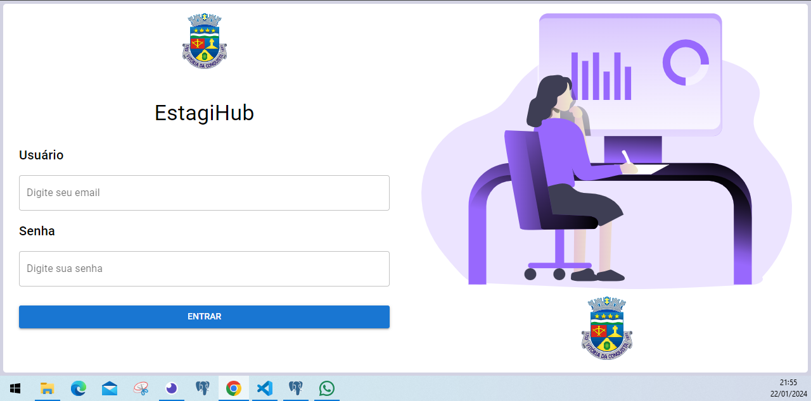

# Quasar App (sistema-gerenciamento-estagiarios-frontend)

Atualmente na coordenação de tecnologia da Informação - CTI, principalmente no setor dedesenvolvimentos, existe uma grande quantidade de estagiários. Diante disso, se torna umdesafio, a gestão documental e organizacional da equipe no que diz respeito aogerenciamento de contratos, férias, folgas, etc. Com isso, se faz necessário o uso de algummecanismo tecnológico capaz de auxiliar a gestão nesta demanda.

## Install the dependencies
```bash
yarn
# or
npm install
```

### Start the app in development mode (hot-code reloading, error reporting, etc.)
```bash
quasar dev
```

### Andamento
#### Tela de login
Inicialmente, comecei a parte de frontend do projeto pela tela de login, mostrada abaixo:

As imagens ainda não são definitivas, pretendo ajustar a tela a medida que for evoluindo no processo. Os campos de texto ainda não foram vinculados a nenhum objeto apenas tem a sua rota configurada para a Index page.

#### Tela dashboards

A Index page é a tela inicial da aplicação e exibe alguns cards que futuramente exibira os dados de estagiários.

#### Tela de Usuários (Dados)

Essa tela conta com a tabela de usuários que eventuamente exibira os dados dos usuários. O botão novo usuário abre o formulário de cadastro, porém tanto o campo de pesquisa, quanto os campos do formulário ainda não foram configurados para transmitir os dados necessários.

#### Tela de usuários (Cadastro)

Tela revelada após pressionar o botão de novo usuário.

#### Tela de Estagiários (Dados)

Essa tela conta com a tabela de estagiários que eventuamente exibira os dados dos estagiários.

#### Tela de Estagiários (Cadastro)

Essa mostra uma breve visualização da tela de cadastro de estagiários.

### Lint the files
```bash
yarn lint
# or
npm run lint
```


### Build the app for production
```bash
quasar build
```

### Customize the configuration
See [Configuring quasar.config.js](https://v2.quasar.dev/quasar-cli-vite/quasar-config-js).
